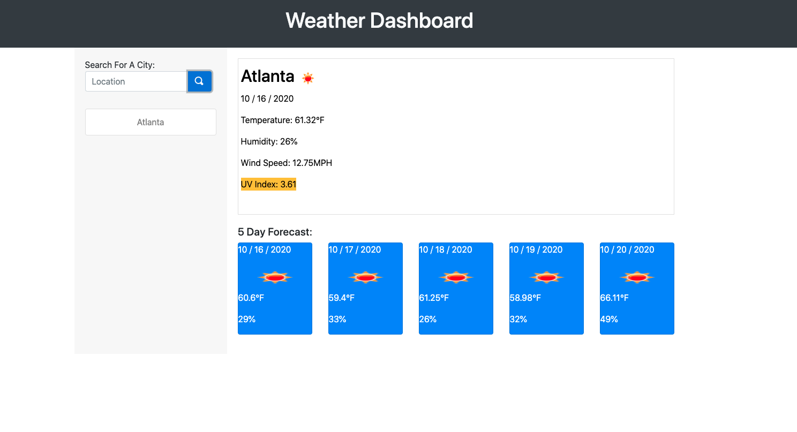
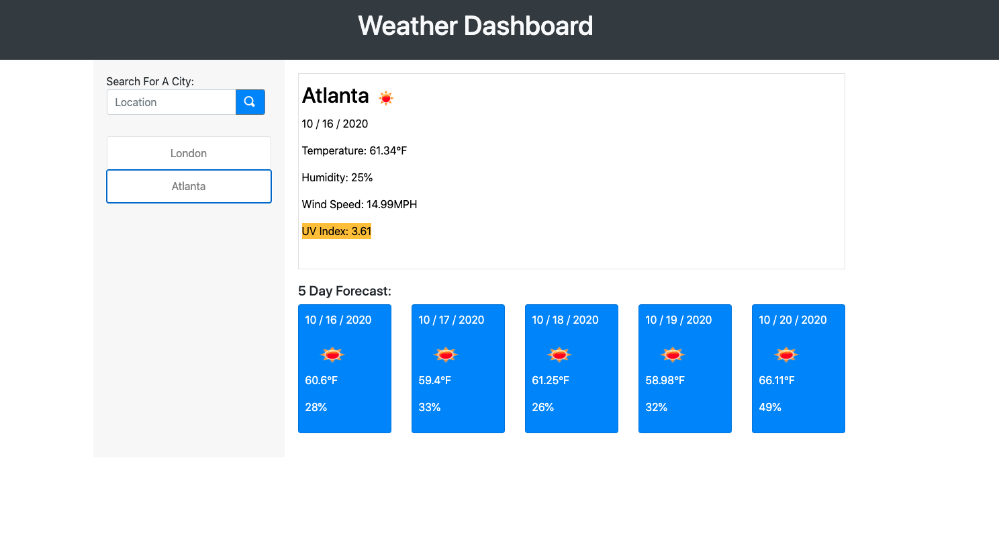

# Weather Dashboard

## Goal
Object is to create a weather dashboard that allows the user to search for a city and it gives them the current weather and a five day forecast.

- When the user puts a city into the form they get the current weather with a color coded UV index.
- The user will also get the five day forecast for that city
- That city's name will also be stored into the left colum so it can be clicked again
- When another city is put into the form it is added to the left colum and then it's weather is displayed
- if the user clicks on one of the previously visited weather buttons that city's weather will appear in the dashboard.

### [Click Here](https://ericasiegel.github.io/wether-dashboard/) to see the app.

### Weather with one city

### Weather with 2 cities

